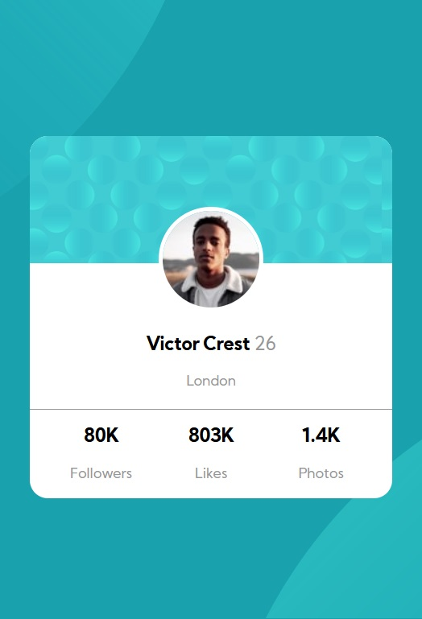
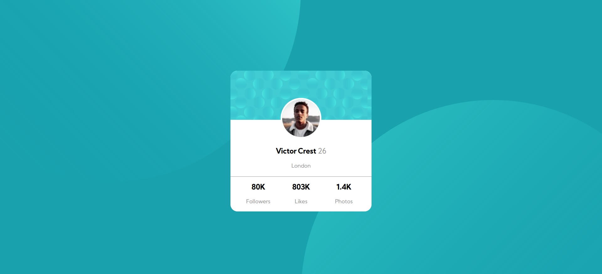

# Frontend Mentor - Profile card component

This is a solution to the [Profile card component](https://www.frontendmentor.io/challenges/profile-card-component-cfArpWshJ). Frontend Mentor challenges help you improve your coding skills by building realistic projects. 

## Table of contents

- [Overview](#overview)
  - [The challenge](#the-challenge)
  - [Screenshot](#screenshot)
  - [Links](#links)
- [My process](#my-process)
  - [Built with](#built-with)
  - [What I learned](#what-i-learned)
  - [Continued development](#continued-development)
- [Author](#author)

## Overview

### The challenge

Users should be able to:

- View the optimal layout for the site depending on their device's screen size

### Screenshot
#### MOBILE LAYOUT:

#### DESKTOP LAYOUT:

### Links

- Solution URL: [https://www.frontendmentor.io/solutions/profilecardgridlayout-mUtCo2Abo]
- Live Site URL: [https://frontendmentor-profilecard.netlify.app/]

## My process

### Built with

- Semantic HTML5 markup
- CSS
- CSS Grid

### What I learned
The most important thing I had learned, was about the position of the objects, and how to play with the SVG, in special, how to make it adaptable for various resolutions without having to use media queries.
Another knowledges I have won with this challenge are about the propertie "box-sizing" and its effects in padding and margin; also about the relative measures, likes vh or vw. 

### Continued development

How to apply correctly GRID, for moments I fell with doubts about its behaviour.
Learn more about standars to declared CSS

## Author
<h4>Gabo Pereyra</h4>

- GitHub - [@gabopereyra](https://github.com/gabopereyra)
- Frontend Mentor - [@gabopereyra](https://www.frontendmentor.io/profile/gabopereyra)
- Twitter - [@gabs_pereyra](https://github.com/gabopereyra)
